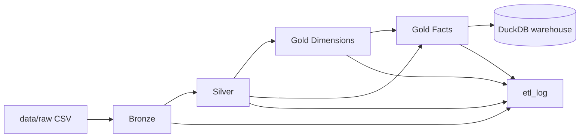

# ETL Detailed Execution Report - 2026-04-24

## 1) Executive summary

- Đã triển khai và push thành công bản sửa để chạy ETL nhẹ máy: thêm `--sample-rows` cho Bronze ingest.
- Đã fix triệt để lỗi test ghi đè dữ liệu thật (`tests/conftest.py` snapshot/restore).
- Đã chạy ETL end-to-end trên dữ liệu thực tế đang có trong `data/raw` và thu được số liệu thực.
- Trạng thái chạy mới nhất: `all / SUCCESS` trong `etl_log`, với bộ sample đồng bộ khóa ở mức ~5k dòng.

---

## 2) Phạm vi báo cáo

Báo cáo này ghi nhận:

1. Toàn bộ thay đổi code đã thực hiện liên quan ETL + test data safety.
2. Dữ liệu raw thực tế tại thời điểm chạy.
3. Quy trình chạy ETL thực tế và kết quả từng lớp Bronze/Silver/Gold.
4. Các vấn đề phát sinh trong quá trình chạy, nguyên nhân gốc, cách xử lý.
5. Kết quả kiểm thử chất lượng và phân tích chênh lệch dữ liệu fact.

---

## 3) Thay đổi code đã triển khai

## 3.1 `etl/jobs/run_etl.py`

**Mục tiêu:** giảm tải máy khi ingest dữ liệu lớn.

**Đã thêm:**

- Tham số CLI:
  - `--sample-rows <int>`
- Luồng xử lý Bronze:
  - Nếu có `sample_rows` thì `read_csv_auto(... ) LIMIT sample_rows`.
  - Nếu không có thì giữ nguyên hành vi cũ (load full file).
- Guard:
  - Nếu `sample_rows <= 0` thì raise lỗi rõ ràng.

**Tác động:**

- Có thể chạy nhẹ máy với tập sample nhưng không phải sửa SQL gốc.
- Không phá backward compatibility (không truyền cờ thì chạy như trước).

## 3.2 `tests/conftest.py`

**Root cause đã xác định:**

- Fixture test session trước đây `autouse=True` ghi đè trực tiếp `data/raw/*.csv`.
- Hệ quả: sau khi chạy `pytest`, dữ liệu người dùng vừa tải bị mất/đè.

**Fix đã áp dụng:**

- Trước khi setup sample test: snapshot bytes của toàn bộ file bị ảnh hưởng.
- Sau test (`finally`): restore nguyên trạng từng file.
- Bao gồm cả:
  - `data/raw/*.csv`
  - `data/seed/branches.csv`
  - `data/warehouse/instacart.duckdb`

**Kết quả:**

- Chạy test quality không còn làm “clobber” dữ liệu raw thực.

## 3.3 `README.md`

- Đã thêm ví dụ chạy nhẹ máy:

```bash
python etl.py --stage all --sample-rows 100
```

---

## 4) Trạng thái Git

**Branch:** `main`  
**Remote:** `origin` (`https://github.com/wwenrr/btl-datawarehouse.git`)

**Commit gần nhất (đã push):**

- `74383b3 feat: add sample-row ingest and preserve raw data in tests`

---

## 5) Dữ liệu đầu vào thực tế (`data/raw`) tại thời điểm chạy

## 5.1 Kích thước file

| File | Size |
|---|---:|
| aisles.csv | 2.6K |
| departments.csv | 270B |
| order_products__prior.csv | 69K |
| order_products__train.csv | 75K |
| orders.csv | 28K |
| products.csv | 184K |

## 5.2 Số dòng thực tế

| File | Lines |
|---|---:|
| aisles.csv | 135 |
| departments.csv | 22 |
| order_products__prior.csv | 5001 |
| order_products__train.csv | 5001 |
| orders.csv | 979 |
| products.csv | 4623 |
| **Total** | **15761** |

> Ghi chú: `aisles` và `departments` là file nhỏ gốc; `orders`/`products` được lọc đồng bộ theo khóa từ sample line-item nên không luôn đúng 5001.

---

## 6) Quy trình chạy thực tế (step-by-step)

## 6.1 Lệnh chạy ETL

```bash
python etl.py --stage all --sample-rows 5000 --skip-quality
```

---

## 13) Source-to-Target mapping (mức triển khai)

## 13.1 Mapping chính từ raw -> silver

| Nguồn raw | Đích silver | Rule xử lý |
|---|---|---|
| `orders.order_id` | `stg_orders.order_id` | `cast(... as bigint)`, loại null |
| `orders.user_id` | `stg_orders.user_id` | `cast(... as bigint)`, loại null |
| `orders.order_number` | `stg_orders.order_number` | `cast(... as int)` |
| `orders.order_dow` | `stg_orders.order_dow` | `cast(... as int)` |
| `orders.order_hour_of_day` | `stg_orders.order_hour_of_day` | `cast(... as int)` |
| `orders.days_since_prior_order` | `stg_orders.days_since_prior_order` | `coalesce(cast(... as int), 0)` |
| `orders.*` | `stg_orders.synthetic_order_date` | tính từ mốc `2024-01-01` + cumulative `days_since_prior_order` theo `user_id, order_number` |
| `order_products__prior.* + order_products__train.*` | `stg_order_products.*` | `union all` + `select distinct` + cast kiểu + lọc null key |
| `products.product_name` | `stg_products.product_name` | `trim(product_name)` |
| `products.product_id/aisle_id/department_id` | `stg_products.*` | cast chuẩn kiểu số |
| `stg_orders.user_id` | `stg_users.user_id` | group by user |
| `stg_orders` | `stg_users.total_orders` | `count(*)` |

## 13.2 Mapping từ silver -> gold dimensions

| Nguồn silver/bronze | Đích gold | Rule |
|---|---|---|
| `stg_orders.synthetic_order_date` | `dim_date.full_date` | distinct date |
| `dim_date.full_date` | `dim_date.date_key` | `abs(hash(date))` |
| `stg_products + bronze_aisles + bronze_departments` | `dim_product` | join theo `aisle_id`, `department_id` |
| `stg_products.product_name` | `dim_product.is_organic` | regex match `'organic'` |
| `stg_users.total_orders` | `dim_customer.membership_tier` | `>=40 Platinum`, `>=15 Gold`, else Silver |
| `data/seed/branches.csv` | `dim_branch` | read full seed + hash key |

## 13.3 Mapping vào facts

| Fact | Grain | Nguồn chính | Join bắt buộc |
|---|---|---|---|
| `fact_order_line` | 1 dòng / `(order_id, product_id, add_to_cart_order)` | `stg_order_products` | `stg_orders`, `dim_date`, `dim_product`, `dim_customer`, `dim_branch` |
| `fact_order_summary` | 1 dòng / `order_id` | `fact_order_line` | `stg_orders` (để lấy `days_since_prior`) |

---

## 14) Runbook vận hành & debug nhanh

## 14.1 Quy trình chạy chuẩn

1. Chuẩn bị raw files trong `data/raw/`.
2. (Khuyến nghị) reset DB nếu muốn clean baseline:
   ```bash
   rm -f data/warehouse/instacart.duckdb
   ```
3. Chạy ETL:
   ```bash
   python etl.py --stage all --sample-rows 5000 --skip-quality
   ```
4. Chạy quality:
   ```bash
   pytest tests/quality -q
   ```
5. Kiểm tra log:
   ```sql
   select stage,status,rows_loaded,watermark_order_id,message
   from etl_log order by finished_at desc limit 5;
   ```

## 14.2 Khi fact = 0

Checklist điều tra theo thứ tự:

1. Check overlap order:
   ```sql
   select count(distinct o.order_id)
   from stg_orders o
   join stg_order_products op on op.order_id = o.order_id;
   ```
2. Nếu overlap = 0: raw sample đang không đồng bộ key, cần cắt sample lại theo cùng tập `order_id`.
3. Nếu overlap > 0 nhưng fact vẫn thấp: kiểm tra missing join tới `dim_product`, `dim_customer`, `dim_date`, `dim_branch`.

## 14.3 Khi `rows_loaded` thay đổi giữa các run

- Đây là expected behavior nếu có incremental ở `bronze_orders`.
- So sánh:
  - clean run: `bronze_delta + silver_rebuild + gold_rebuild`
  - rerun: thường `0 + silver_rebuild + gold_rebuild`

---

## 15) Checklist nghiệm thu ETL scope (ready-to-submit)

| Tiêu chí | Kết quả hiện tại | Trạng thái |
|---|---|---|
| Pipeline Bronze/Silver/Gold chạy end-to-end | Có (`stage all SUCCESS`) | ✅ |
| Cleaning/standardization/discretization/aggregation | Có trong `stg_*`, `dim_customer`, `fact_order_summary` | ✅ |
| Incremental + ETL log | Có (`bronze_orders` watermark + `etl_log`) | ✅ |
| Dữ liệu fact có record thực | `fact_order_line=10000`, `fact_order_summary=978` | ✅ |
| Data quality tests | `20 passed` | ✅ |
| Tài liệu quy trình ETL chi tiết | Có file report + `docs/etl-process.md` | ✅ |


## 6.2 Lệnh chạy quality tests

```bash
pytest tests/quality -q
```

**Kết quả:** `20 passed`

## 6.3 Mermaid data flow



## 6.4 Giải thích kỹ từng setup trong ETL

### a) Setup config (`etl/config/settings.yaml`)

- `database_path: data/warehouse/instacart.duckdb`
  - **Làm gì:** chỉ định file DuckDB đích.
  - **Impact:** toàn bộ bảng Bronze/Silver/Gold và `etl_log` nằm trong file này.
- `raw_data_dir: data/raw`
  - **Làm gì:** chỉ định nơi đọc CSV đầu vào.
  - **Impact:** đổi path này là đổi toàn bộ nguồn ingest.
- `seed_data_dir: data/seed`
  - **Làm gì:** nơi đọc seed dữ liệu phụ (ví dụ branch).
  - **Impact:** ảnh hưởng trực tiếp `dim_branch`.

### b) Setup command line (`etl/jobs/run_etl.py`)

- `--stage {bronze|silver|gold|all}`
  - **Làm gì:** chọn phạm vi chạy.
  - **Impact:** kiểm soát mức độ xử lý và thời gian chạy.
- `--skip-quality`
  - **Làm gì:** bỏ bước `pytest tests/quality -q` trong stage `all`.
  - **Impact:** chạy nhanh hơn, nhưng không có chốt quality cuối flow.
- `--sample-rows N` (mới thêm)
  - **Làm gì:** giới hạn số dòng ingest cho mỗi bảng Bronze.
  - **Impact:** giảm RAM/CPU/disk I/O; đổi phân phối dữ liệu downstream (có thể làm fact rỗng nếu sample không đồng bộ key).
- Guard `sample_rows > 0`
  - **Làm gì:** chặn cấu hình sai.
  - **Impact:** fail fast, tránh tạo dataset lỗi/khó debug.

### c) Setup Bronze

- Validate source (`validate_sources`) trước ingest.
- Đọc `orders.csv` vào temp `_orders_src`.
- Ingest incremental vào `bronze_orders` theo `watermark_order_id` + anti-duplicate theo `order_id`.
- Các bảng Bronze còn lại được `create or replace` từ CSV.

**Impact chính:**
- `bronze_orders` có logic incremental (không append trùng).
- `bronze_order_products_*`, `bronze_products`, `bronze_aisles`, `bronze_departments` là snapshot theo lần chạy.
- Nếu dùng `--sample-rows`, tất cả Bronze đọc theo top-N.

### d) Setup Silver

- Chạy tuần tự SQL:
  - `stg_orders.sql`
  - `stg_order_products.sql`
  - `stg_products.sql`
  - `stg_users.sql`

**Impact chính:**
- Chuẩn hóa type và business logic để cấp dữ liệu ổn định cho Gold.
- `stg_order_products` là điểm hợp nhất prior + train.

### e) Setup Gold

- Đảm bảo seed branch tồn tại (`ensure_branch_seed_exists`).
- Dựng dim:
  - `dim_date`, `dim_product`, `dim_customer`, `dim_branch`
- Dựng fact:
  - `fact_order_line`, `fact_order_summary`

**Impact chính:**
- Tạo mô hình star schema phục vụ phân tích.
- Fact phụ thuộc chặt vào độ khớp khóa join từ Silver + Dim.

### f) Setup logging (`etl_log`)

Trước khi chạy stage, pipeline luôn đảm bảo tồn tại bảng:

```sql
etl_log(
  run_id, stage, started_at, finished_at,
  status, rows_loaded, watermark_order_id, message
)
```

**Ý nghĩa field:**
- `run_id`: id duy nhất mỗi lần chạy.
- `stage`: bronze/silver/gold/all.
- `started_at`, `finished_at`: mốc thời gian.
- `status`: SUCCESS / FAILED.
- `rows_loaded`: số dòng pipeline ghi nhận đã xử lý ở stage đó.
- `watermark_order_id`: watermark incremental của orders.
- `message`: thông điệp ngắn (`OK` hoặc lỗi cắt tối đa 500 ký tự).

**Impact chính:**
- Cho phép audit, retry, truy vết lỗi và theo dõi incremental load.

## 6.5 Giải thích chi tiết quy trình Bronze -> Silver -> Gold

### A. Bronze (Raw Landing + Ingest)

**Mục tiêu:** đưa dữ liệu CSV vào DuckDB gần như nguyên bản để làm nguồn chuẩn hóa.

**Input:**
- `data/raw/orders.csv`
- `data/raw/order_products__prior.csv`
- `data/raw/order_products__train.csv`
- `data/raw/products.csv`
- `data/raw/aisles.csv`
- `data/raw/departments.csv`

**Xử lý chính:**
1. `validate_sources()` kiểm tra đủ file đầu vào, thiếu file sẽ dừng ngay.
2. `orders.csv` được đọc vào temp table `_orders_src`.
3. `bronze_orders` ingest incremental:
   - chỉ insert `order_id > watermark_order_id` lần SUCCESS gần nhất trong `etl_log`
   - chống trùng theo `order_id` bằng `not exists`.
4. Các bảng Bronze còn lại (`order_products_*`, `products`, `aisles`, `departments`) dùng `create or replace` theo snapshot của file hiện tại.
5. Nếu bật `--sample-rows N`: mỗi bảng Bronze chỉ lấy top-N dòng.

**Output:**
- 6 bảng Bronze dùng làm nguồn chuẩn hóa cho Silver.

**Impact thiết kế:**
- Giữ dữ liệu “thô” để trace/debug dễ.
- `bronze_orders` hỗ trợ incremental; các bảng Bronze khác là full replace theo lần chạy.
- `--sample-rows` giúp nhẹ máy nhưng có thể làm mất tính đại diện dữ liệu.

### B. Silver (Standardization + Integration)

**Mục tiêu:** chuẩn hóa schema, ép kiểu dữ liệu, hợp nhất source để tạo layer “đã làm sạch”.

#### 1) `stg_orders`
- Ép kiểu:
  - `order_id`, `user_id` -> `BIGINT`
  - các trường số còn lại -> `INT`
- `days_since_prior_order` null -> `0` (`coalesce`).
- Loại dòng thiếu `order_id` hoặc `user_id`.
- Tạo `synthetic_order_date`:
  - mốc gốc `2024-01-01`
  - cộng dồn `days_since_prior_order` theo từng `user_id`, sắp theo `order_number`.

**Ý nghĩa:** có cột date nhất quán để dựng `dim_date` và join fact.

#### 2) `stg_order_products`
- Gộp `bronze_order_products_prior` + `bronze_order_products_train` bằng `union all`.
- Chuẩn hóa kiểu và `select distinct` để giảm duplicate dòng giống hệt.
- Loại dòng thiếu `order_id` hoặc `product_id`.

**Ý nghĩa:** tạo một nguồn line-item thống nhất cho mọi phân tích giỏ hàng.

#### 3) `stg_products`
- Chuẩn hóa `product_id`, `aisle_id`, `department_id`.
- `trim(product_name)` để giảm lỗi do khoảng trắng.

**Ý nghĩa:** đảm bảo khóa join chuẩn với dim/fact.

#### 4) `stg_users`
- Tổng hợp theo `user_id`: `count(*) as total_orders`.

**Ý nghĩa:** làm nền cho phân hạng khách hàng ở `dim_customer`.

**Output Silver:**
- `stg_orders`, `stg_order_products`, `stg_products`, `stg_users`.

### C. Gold (Star Schema: Dimensions + Facts)

**Mục tiêu:** tạo mô hình phân tích ổn định cho BI/reporting.

#### 1) Dimensions

**`dim_date`**
- Lấy `distinct synthetic_order_date` từ `stg_orders`.
- Sinh `date_key = abs(hash(date))`.
- Bóc tách thuộc tính lịch: day/month/quarter/year/day_of_week/is_weekend.

**`dim_product`**
- Từ `stg_products` join `bronze_aisles` + `bronze_departments`.
- Sinh `product_key`.
- Gắn nhãn `is_organic` dựa trên regex trong `product_name`.

**`dim_customer`**
- Từ `stg_users`, sinh `customer_key`.
- Rule phân hạng:
  - `>= 40`: Platinum
  - `>= 15`: Gold
  - còn lại: Silver

**`dim_branch`**
- Đọc seed `data/seed/branches.csv`.
- Sinh `branch_key`.
- Mục tiêu là luôn có branch dimension để fact join ổn định.

#### 2) Facts

**`fact_order_line`** (grain: 1 dòng mỗi item trong order)
- Nguồn chính: `stg_order_products op`.
- Join bắt buộc:
  - `stg_orders o` theo `order_id`
  - `dim_date dd` theo `synthetic_order_date`
  - `dim_product dp` theo `product_id`
  - `dim_customer dc` theo `user_id`
  - `dim_branch db` cố định `DEFAULT_BRANCH`
- Sinh `order_line_key = hash(order_id, product_id, add_to_cart_order)`.
- `quantity = 1`, `reordered` cast boolean.

**`fact_order_summary`** (grain: 1 dòng mỗi order)
- Tổng hợp từ `fact_order_line`.
- Tính:
  - `total_items`
  - `total_distinct_items`
  - `days_since_prior` (lấy từ `stg_orders`).

### D. Vì sao Gold fact có thể bằng 0 dù pipeline SUCCESS (và cách đã xử lý)

Điều kiện tạo fact đòi hỏi **join key khớp xuyên suốt**.
Chỉ cần một mắt xích không khớp (đặc biệt `order_id` giữa `stg_orders` và `stg_order_products`) thì:
- `fact_order_line` = 0
- `fact_order_summary` = 0

Trường hợp cũ (đã gặp):
- `orders_total = 500`
- `op_total_orders = 101`
- `orders_in_op = 0`

=> Không có giao nhau `order_id`, nên fact rỗng dù job vẫn SUCCESS.

Trường hợp hiện tại (đã xử lý bằng sample đồng bộ khóa):
- `stg_orders = 978`
- `stg_order_products = 10000`
- `overlap_orders = 978`
- `fact_order_line = 10000`
- `fact_order_summary = 978`

=> Fact đã có dữ liệu và phản ánh đúng overlap key giữa orders và order_products.

### E. Checklist đọc kết quả ETL

1. Xem `etl_log`: có SUCCESS/FAILED, rows_loaded, watermark.
2. Đếm row từng lớp Bronze/Silver/Gold:
   - Bronze có dữ liệu chưa?
   - Silver có tăng tương ứng chưa?
   - Fact có > 0 không?
3. Nếu fact = 0:
   - kiểm tra overlap `order_id` giữa `stg_orders` và `stg_order_products`
   - kiểm tra join dim có bị thiếu key không.
4. Nếu quality test fail:
   - đọc lỗi test để biết fail ở schema, grain hay orphan FK.

---

## 7) Kết quả dữ liệu thu được trong warehouse (thực tế)

## 7.1 Danh sách bảng tồn tại và tác dụng

| Bảng | Tầng | Tác dụng |
|---|---|---|
| bronze_orders | Bronze | Bản sao thô từ `orders.csv`; là nguồn đơn hàng đầu vào có incremental theo watermark. |
| bronze_order_products_prior | Bronze | Bản sao thô line-item của tập prior. |
| bronze_order_products_train | Bronze | Bản sao thô line-item của tập train. |
| bronze_products | Bronze | Bản sao thô danh mục sản phẩm và khóa aisle/department. |
| bronze_aisles | Bronze | Bản sao thô map `aisle_id -> aisle`. |
| bronze_departments | Bronze | Bản sao thô map `department_id -> department`. |
| stg_orders | Silver | Chuẩn hóa orders (type casting, xử lý null, tạo `synthetic_order_date`). |
| stg_order_products | Silver | Hợp nhất prior + train thành một bảng line-item chuẩn. |
| stg_products | Silver | Làm giàu product bằng join aisle + department. |
| stg_users | Silver | Tổng hợp theo `user_id` để tạo chỉ số/thuộc tính khách hàng. |
| dim_date | Gold Dim | Dimension thời gian để phân tích theo lịch. |
| dim_product | Gold Dim | Dimension sản phẩm phục vụ slicing theo danh mục. |
| dim_customer | Gold Dim | Dimension khách hàng phục vụ cohort/segmentation. |
| dim_branch | Gold Dim | Dimension chi nhánh (seed) để đảm bảo fact có branch key. |
| fact_order_line | Gold Fact | Fact hạt mịn cấp dòng sản phẩm trong đơn. |
| fact_order_summary | Gold Fact | Fact tổng hợp cấp đơn hàng. |
| etl_log | Meta | Nhật ký run ETL: trạng thái, sản lượng, watermark, thông điệp lỗi/thành công. |

## 7.2 Row count theo bảng

| Table | Rows |
|---|---:|
| bronze_orders | 978 |
| bronze_order_products_prior | 5000 |
| bronze_order_products_train | 5000 |
| bronze_products | 4622 |
| bronze_aisles | 134 |
| bronze_departments | 21 |
| stg_orders | 978 |
| stg_order_products | 10000 |
| stg_products | 4622 |
| stg_users | 976 |
| dim_date | 31 |
| dim_product | 4622 |
| dim_customer | 976 |
| dim_branch | 1 |
| fact_order_line | 10000 |
| fact_order_summary | 978 |
| etl_log | 2 |

## 7.3 ETL log (clean run tham chiếu)

```text
('all', 'SUCCESS', 20978, 12525, 'OK')
```

Giải thích bản ghi trên:

- `SUCCESS` nghĩa là stage `all` hoàn tất không exception.
- `rows_loaded = 20978` = `bronze_rows (978) + silver_rows (10000) + gold_rows (10000)`.
- `watermark_order_id = 12525` là mốc `order_id` lớn nhất đã ghi nhận trong run hiện tại.
- `message = OK` là không phát sinh exception trong try/catch của `run_stage`.

## 7.4 Kết quả kiểm chứng bổ sung (rerun incremental + chất lượng dữ liệu)

Sau khi đã có clean run ở trên, thực hiện thêm một lần rerun stage `all` cùng cấu hình để kiểm tra hành vi incremental:

```text
('all', 'SUCCESS', 20000, 12525, 'OK')
```

Diễn giải:

- `rows_loaded = 20000` ở rerun vì `bronze_orders` incremental không nạp thêm (`delta = 0`), còn Silver/Gold vẫn được rebuild.
- `watermark_order_id` giữ nguyên `12525`, đúng kỳ vọng của incremental theo `orders`.

Chỉ số chất lượng dữ liệu sau rerun:

| Metric | Value |
|---|---:|
| fact_line_duplicates | 0 |
| fact_summary_duplicates | 0 |
| orphan_product_fk | 0 |
| orphan_customer_fk | 0 |
| orphan_date_fk | 0 |
| orphan_branch_fk | 0 |

Hiệu năng tham chiếu trên môi trường hiện tại:

| Check | Result |
|---|---|
| ETL runtime (`stage all`, sample 5k) | `1.61s` |
| Quality tests | `20 passed in 1.28s` |

## 7.5 Timeline run + đối soát số liệu (reconciliation)

Timeline 2 run gần nhất trong `etl_log`:

```text
('all', 'SUCCESS', 20000, 12525, 'OK', '2026-04-24 23:18:36.756', '2026-04-24 23:18:36.756')
('all', 'SUCCESS', 20978, 12525, 'OK', '2026-04-24 23:14:19.445', '2026-04-24 23:14:19.445')
```

Đối soát nghiệp vụ:

- `fact_order_summary` phải bằng số `order_id` distinct của `stg_orders`.
- Kết quả thực tế: `(978, 978)` -> khớp.

Đối soát kỹ thuật:

- Clean run: `rows_loaded = bronze_orders + stg_order_products + fact_order_line = 978 + 10000 + 10000 = 20978`.
- Rerun: bronze incremental không nạp mới (`+0`) nên `rows_loaded = 10000 + 10000 = 20000`.

Lưu ý hiện trạng logging:

- `started_at` và `finished_at` đang cùng timestamp do hàm `write_etl_log` dùng `now()` cho cả 2 field tại thời điểm ghi log cuối.
- Trường này đủ cho audit trạng thái, nhưng chưa phản ánh duration nội bộ từng stage.

---

## 8) Mẫu dữ liệu thực tế thu được (query output)

## 8.1 `stg_orders` (5 dòng đầu)

```text
(7099, 27, 63, 3, 10, 1, 2024-09-30)
(8382, 23, 2, 0, 10, 9, 2024-01-10)
(19256, 13, 4, 1, 12, 9, 2024-01-24)
(23391, 7, 17, 0, 10, 28, 2024-07-05)
(62370, 30, 9, 2, 13, 22, 2024-06-22)
```

## 8.2 `stg_order_products` (5 dòng đầu)

```text
(1, 49302, 1, 1)
(1, 11109, 2, 1)
(1, 10246, 3, 0)
(1, 49683, 4, 0)
(1, 43633, 5, 1)
```

## 8.3 `dim_product` (5 dòng đầu)

```text
(5151560746008520, '498', 'Daily Moisture Shampoo', 'hair care', 'personal care', false)
(98808916558076459, '192', 'Israeli Style Gefilte Fish', 'kosher foods', 'international', false)
(103086454275167595, '313', 'Peppermint/Banana Split Variety Pack Frozen Dairy Dessert Cones', 'ice cream ice', 'frozen', false)
(103703464254872247, '456', 'Sparkling Blueberry', 'soft drinks', 'beverages', false)
(131258244262156875, '460', 'Acai Dragonfruit Melon Green Tea', 'tea', 'beverages', false)
```

## 8.4 `dim_customer` (5 dòng đầu)

```text
(238047645290109433, '28', 'Gold', 25)
(420761150550123347, '26', 'Silver', 13)
(1076707059149957606, '30', 'Silver', 9)
(1776201668740198182, '22', 'Gold', 16)
(2105496855350268822, '6', 'Silver', 4)
```

---

## 9) Phân tích sự cố và xử lý

## 9.1 Sự cố A - test ghi đè dữ liệu raw

**Triệu chứng:**

- Sau khi chạy `pytest`, dữ liệu `data/raw` bị thu nhỏ về sample test.

**Điều tra:**

- Fixture session trong `tests/conftest.py` ghi trực tiếp vào `data/raw/*.csv`.

**Root cause:**

- Test setup dùng chung path với dữ liệu chạy thật, không restore sau test.

**Khắc phục:**

- Áp dụng snapshot/restore trong fixture.

**Trạng thái sau fix:**

- `pytest tests/quality -q` pass và dữ liệu raw được giữ nguyên.

## 9.2 Sự cố B - khác biệt artifact Kaggle khi tải file nhỏ

**Triệu chứng:**

- Với một số file nhỏ (ví dụ `aisles.csv`), Kaggle CLI tải ra plain `.csv` thay vì `.zip`.

**Khắc phục:**

- Luồng tải xử lý cả 2 nhánh:
  - Nếu có `tmp/<file>.csv` -> đọc trực tiếp.
  - Nếu có `tmp/<file>.zip` -> `unzip -p`.

---

## 10) Phân tích kết quả fact sau khi chuyển sang sample đồng bộ 5k

Kết quả chính:

- `stg_orders = 978`
- `stg_order_products = 10000`
- `overlap_orders = 978`
- `fact_order_line = 10000`
- `fact_order_summary = 978`

**Diễn giải:**

- Bộ sample mới được cắt theo hướng đồng bộ khóa `order_id`/`product_id` giữa các file raw.
- Vì có overlap key thực, join ở Gold tạo được đầy đủ fact line và fact summary.

**Kết luận kỹ thuật:**

- Pipeline chạy thành công.
- Fact không còn rỗng; output hiện tại đã phù hợp mục tiêu ETL scope.

---

## 11) Khuyến nghị vận hành tiếp theo

1. Nếu mục tiêu là chạy nhẹ máy: giữ `--sample-rows` (100/500/1000/5000 tùy RAM).
2. Nếu mục tiêu là có fact records:
   - Sample theo **cùng tập `order_id`** giữa `orders` và `order_products__*`, không lấy top-N độc lập.
3. Nếu cần benchmark đúng hơn:
   - Chạy riêng 2 mode và so sánh:
     - `--sample-rows` (nhẹ, dev nhanh)
     - full dataset (đánh giá gần production hơn)

---

## 12) Command appendix (đã dùng trong phiên này)

```bash
rm -f data/warehouse/instacart.duckdb
python etl.py --stage all --sample-rows 5000 --skip-quality
pytest tests/quality -q
wc -l data/raw/*.csv

# kiểm tra thời gian chạy và rerun incremental
/usr/bin/time -f 'ETL_RUNTIME_SECONDS=%e' python etl.py --stage all --sample-rows 5000 --skip-quality
python etl.py --stage all --sample-rows 5000 --skip-quality
```

---

## 16) SQL kiểm chứng nhanh

### 16.1 Kiểm tra fact có data và khớp số đơn

```sql
select count(*) as fact_order_summary_rows from fact_order_summary;
select count(distinct order_id) as stg_distinct_orders from stg_orders;
```

Kỳ vọng với run hiện tại: `978` và `978`.

### 16.2 Kiểm tra duplicate theo grain

```sql
select count(*) as dup_fact_order_line
from (
  select order_id_nk, product_key, add_to_cart_order, count(*) c
  from fact_order_line
  group by 1,2,3
  having c > 1
);

select count(*) as dup_fact_order_summary
from (
  select order_id_nk, count(*) c
  from fact_order_summary
  group by 1
  having c > 1
);
```

Kỳ vọng: cả hai đều `0`.

### 16.3 Kiểm tra orphan FK

```sql
select count(*) as orphan_product_fk
from fact_order_line f
left join dim_product d on d.product_key = f.product_key
where d.product_key is null;

select count(*) as orphan_customer_fk
from fact_order_line f
left join dim_customer d on d.customer_key = f.customer_key
where d.customer_key is null;

select count(*) as orphan_date_fk
from fact_order_line f
left join dim_date d on d.date_key = f.date_key
where d.date_key is null;

select count(*) as orphan_branch_fk
from fact_order_line f
left join dim_branch d on d.branch_key = f.branch_key
where d.branch_key is null;
```

Kỳ vọng: tất cả `0`.

---

## 17) Phân bố dữ liệu đầu ra (run hiện tại)

| Chỉ số | Giá trị |
|---|---:|
| distinct_orders_stg | 978 |
| distinct_orders_fact_summary | 978 |
| distinct_orders_fact_line | 978 |
| distinct_products_stg_order_products | 4622 |
| distinct_products_dim_product | 4622 |
| line_items_reordered_true | 6014 |
| line_items_reordered_false | 3986 |
| customers_platinum | 0 |
| customers_gold | 0 |
| customers_silver | 976 |

Diễn giải:

- `reordered=true` đang chiếm tỷ trọng cao trong sample hiện tại.
- Toàn bộ khách hàng rơi vào `Silver` vì phân phối `total_orders` ở sample chưa chạm ngưỡng `Gold/Platinum`.
- Đây là expected behavior của sample 5k, không phải lỗi transform.

---

## 18) Giới hạn hiện tại và tác động

1. Incremental hiện chỉ áp dụng rõ ràng cho `bronze_orders`; các bảng Bronze còn lại là snapshot `create or replace`.
2. `started_at`/`finished_at` trong `etl_log` đang cùng thời điểm ghi log, nên chưa phản ánh duration chi tiết từng stage.
3. Sample đồng bộ khóa giúp fact có data, nhưng vẫn là dữ liệu rút gọn nên không đại diện hoàn toàn cho phân phối full dataset.

---

## 19) Data dictionary tóm tắt (các bảng Gold)

## 19.1 Dimensions

| Bảng | Cột | Kiểu | Ý nghĩa |
|---|---|---|---|
| dim_date | date_key | UBIGINT | Surrogate key thời gian |
| dim_date | full_date | DATE | Ngày đầy đủ dùng join fact |
| dim_date | day_of_month, month, quarter, year | BIGINT | Thuộc tính phân tích lịch |
| dim_date | day_of_week | VARCHAR | Tên thứ trong tuần |
| dim_date | is_weekend | BOOLEAN | Cờ cuối tuần |
| dim_product | product_key | UBIGINT | Surrogate key sản phẩm |
| dim_product | product_id_nk | VARCHAR | Natural key từ source |
| dim_product | product_name, aisle_name, department_name | VARCHAR | Thuộc tính phân tích sản phẩm |
| dim_product | is_organic | BOOLEAN | Cờ organic theo regex tên sản phẩm |
| dim_customer | customer_key | UBIGINT | Surrogate key khách hàng |
| dim_customer | user_id_nk | VARCHAR | Natural key user |
| dim_customer | membership_tier | VARCHAR | Phân hạng Silver/Gold/Platinum |
| dim_customer | total_orders | BIGINT | Tổng đơn của user |
| dim_branch | branch_key | UBIGINT | Surrogate key chi nhánh |
| dim_branch | branch_id_nk | VARCHAR | Natural key branch |
| dim_branch | branch_name, city, region | VARCHAR | Thuộc tính địa lý/kinh doanh |

## 19.2 Facts

| Bảng | Cột | Kiểu | Ý nghĩa |
|---|---|---|---|
| fact_order_line | order_line_key | UBIGINT | Surrogate key cho từng line item |
| fact_order_line | order_id_nk | VARCHAR | Mã đơn hàng nguồn |
| fact_order_line | date_key, product_key, customer_key, branch_key | UBIGINT | Khóa ngoại sang dimensions |
| fact_order_line | add_to_cart_order | INTEGER | Thứ tự thêm vào giỏ |
| fact_order_line | reordered | BOOLEAN | Có reorder hay không |
| fact_order_line | quantity | INTEGER | Số lượng item (hiện = 1) |
| fact_order_summary | order_summary_key | UBIGINT | Surrogate key cấp đơn |
| fact_order_summary | order_id_nk | VARCHAR | Mã đơn hàng nguồn |
| fact_order_summary | date_key, customer_key, branch_key | UBIGINT | Khóa ngoại sang dimensions |
| fact_order_summary | total_items | HUGEINT | Tổng line item trong đơn |
| fact_order_summary | total_distinct_items | BIGINT | Số sản phẩm khác nhau trong đơn |
| fact_order_summary | days_since_prior | INTEGER | Số ngày từ đơn trước |

## 19.3 Phạm vi giá trị (run hiện tại)

| Chỉ số | Giá trị |
|---|---|
| date_min_max | `2024-01-01` -> `2024-01-31` |
| days_since_prior_min_max | `0` -> `30` |
| total_items_min_max | `1` -> `54` |

---

## 20) Acceptance criteria chi tiết (ETL scope)

| Nhóm | Tiêu chí pass | Cách kiểm tra | Kết quả hiện tại |
|---|---|---|---|
| Ingestion | Đủ bảng Bronze theo source | `show tables` + count Bronze | Pass |
| Standardization | Có đủ `stg_orders/stg_order_products/stg_products/stg_users` | `show tables` + schema | Pass |
| Modeling | Có đủ 4 dim + 2 fact | `tests/quality/test_schema_contract.py` | Pass |
| Data integrity | Không orphan FK từ `fact_order_line` | SQL orphan checks (mục 16.3) | Pass (0) |
| Grain | Không duplicate grain ở facts | SQL duplicate checks (mục 16.2) | Pass (0) |
| Incremental | Rerun không tăng Bronze orders khi không có delta mới | So sánh `rows_loaded` clean vs rerun | Pass |
| Logging | Có bản ghi SUCCESS/FAILED và watermark | `select ... from etl_log` | Pass (SUCCESS + watermark) |
| Operability | Có runbook + command appendix để tái chạy | Mục 12 + 14 | Pass |

---

## 21) Môi trường tái lập (reproducibility manifest)

| Thành phần | Giá trị |
|---|---|
| OS kernel | `Linux 6.17.0-22-generic` |
| Python | `3.12.3` |
| duckdb | `1.1.3` |
| PyYAML | `6.0.2` |
| pytest | `8.3.5` |
| requirements.txt | `duckdb==1.1.3`, `pandas==2.2.3`, `PyYAML==6.0.2`, `pytest==8.3.5` |

Lệnh setup chuẩn:

```bash
python -m pip install -r requirements.txt
```

---

## 22) Giả định nghiệp vụ và non-goals (ETL scope)

## 22.1 Assumptions

1. Dataset nguồn không có `order_date` thực -> dùng `synthetic_order_date` để phục vụ dimension thời gian.
2. Chi nhánh dùng seed cố định `DEFAULT_BRANCH` cho toàn bộ fact trong phạm vi bài ETL hiện tại.
3. `quantity` ở `fact_order_line` mặc định `1` theo cấu trúc dữ liệu Instacart line-item.
4. Mục tiêu chính là pipeline ETL và tính đúng kỹ thuật dữ liệu, không tối ưu cho production-scale.

## 22.2 Non-goals

1. Chưa triển khai CDC/merge incremental cho toàn bộ bảng Bronze (mới rõ ràng trên `bronze_orders`).
2. Chưa có orchestration scheduler (Airflow/Cron) trong phạm vi report này.
3. Chưa có semantic layer BI hoặc dashboard trong phạm vi ETL scope.
4. Chưa benchmark hiệu năng full dataset để lấy SLA.

---

## 23) Bảng lỗi thường gặp và cách xử lý nhanh

| Triệu chứng | Nguyên nhân khả dĩ | Cách xử lý |
|---|---|---|
| `Missing raw files` khi chạy ETL | Thiếu file trong `data/raw` | Kiểm tra đủ 6 file required rồi chạy lại |
| `fact_order_line = 0` | Không overlap `order_id` giữa `stg_orders` và `stg_order_products` | Cắt sample đồng bộ key rồi rerun clean DB |
| `rows_loaded` khác giữa các run | Bronze incremental không nạp mới ở rerun | Đối soát theo công thức clean vs rerun (mục 7.5) |
| Quality test fail orphan FK | Thiếu join key sang dim | Chạy SQL orphan checks mục 16.3 để xác định dim bị lệch |
| Dữ liệu raw bị “nhỏ lại” sau test | Fixture test ghi đè raw (nếu chưa fix) | Dùng version đã snapshot/restore trong `tests/conftest.py` |

SQL check overlap nhanh:

```sql
select count(distinct o.order_id)
from stg_orders o
join stg_order_products op on op.order_id = o.order_id;
```

---

## 24) Control totals theo tầng (để đối soát nhanh)

| Tầng | Chỉ số kiểm soát | Giá trị hiện tại | Ý nghĩa |
|---|---|---:|---|
| Bronze | `bronze_orders` | 978 | Số đơn ingest sau incremental filter |
| Bronze | `bronze_order_products_prior + train` | 10000 | Tổng line-item raw đã nạp |
| Silver | `stg_orders` | 978 | Đơn hàng hợp lệ sau chuẩn hóa |
| Silver | `stg_order_products` | 10000 | Line-item sau hợp nhất prior/train |
| Gold | `fact_order_line` | 10000 | Line-item fact sau join đủ dim |
| Gold | `fact_order_summary` | 978 | Số đơn fact tổng hợp (1 dòng/đơn) |

Quy tắc đối soát chính:

1. `fact_order_summary` nên bằng số `order_id` distinct trong `stg_orders` nếu join đầy đủ.
2. `fact_order_line` không được vượt quá bất thường so với `stg_order_products` (trừ khi có nhân bản do join sai).
3. Nếu `stg_order_products` lớn nhưng `fact_order_line` nhỏ, ưu tiên kiểm tra join keys sang `stg_orders` và dims.

---

## 25) Dependency map của pipeline (theo thứ tự build)

| Bảng đích | Phụ thuộc trực tiếp |
|---|---|
| bronze_orders | orders.csv |
| bronze_order_products_prior | order_products__prior.csv |
| bronze_order_products_train | order_products__train.csv |
| bronze_products | products.csv |
| bronze_aisles | aisles.csv |
| bronze_departments | departments.csv |
| stg_orders | bronze_orders |
| stg_order_products | bronze_order_products_prior, bronze_order_products_train |
| stg_products | bronze_products |
| stg_users | stg_orders |
| dim_date | stg_orders |
| dim_product | stg_products, bronze_aisles, bronze_departments |
| dim_customer | stg_users |
| dim_branch | data/seed/branches.csv |
| fact_order_line | stg_order_products, stg_orders, dim_date, dim_product, dim_customer, dim_branch |
| fact_order_summary | fact_order_line, stg_orders |
| etl_log | run_etl.py (write_etl_log) |

---

## 26) Checklist bàn giao (submission-ready)

1. Source data đã có đủ 6 file required trong `data/raw`.
2. Đã chạy clean ETL:
   ```bash
   rm -f data/warehouse/instacart.duckdb
   python etl.py --stage all --sample-rows 5000 --skip-quality
   ```
3. Đã chạy quality test:
   ```bash
   pytest tests/quality -q
   ```
4. Đã lưu bằng chứng:
   - row counts mục 7.2,
   - ETL log mục 7.3/7.4/7.5,
   - SQL checks mục 16,
   - control totals mục 24.
5. Đã xác nhận ETL scope pass theo acceptance criteria mục 20.

Khi nộp, chỉ cần giữ nhất quán giữa:
- file code hiện tại,
- DB output mới nhất,
- số liệu ghi trong report này.
